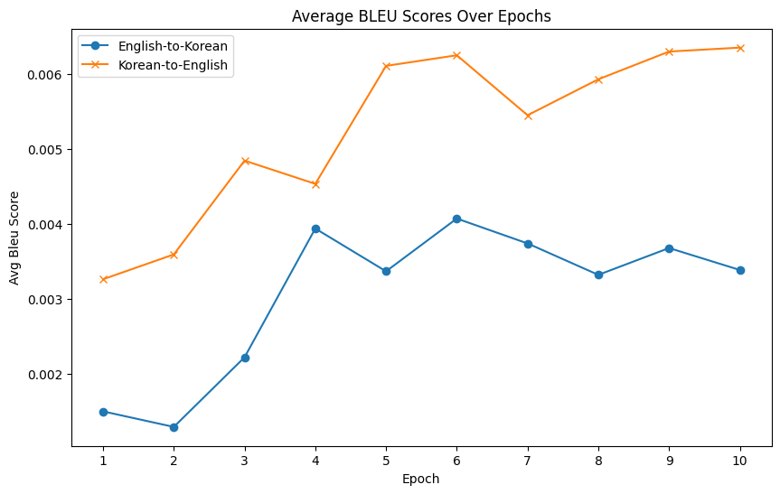

# Transformer_Seq2Seq_Ko_En_Bidirectional_Translator

### About

- A bidirectional (joint model) transformer seq2seq translator model for Korean-to-English translation.
- Two encoder-decoder transformer models have been used to train Korean-to-English and English-to-Korean translators, and the translator wrapper model combines the two models together to create a bidirectional translator that can take in both Korean and English inputs.
- Trained on [Kaggle Ted-Talk Translation Dataset](https://www.kaggle.com/datasets/msarmi9/englishkorean-multitarget-ted-talks-task-mttt).
- The following results show the model trained for 10 epochs (4~5 hours of training on A100 GPU; train for longer epochs to get better performance).

### Translation Examples

- Raw translation outputs are stored in the `translated_dataset_no2_epochs_1_to_10.zip` file.

#### English-to-Korean

> Example 1: (line 361)
```
Original English: Thank you so much.

Actual Korean Translation: 갑사합니다.
Model Translated Korean: 감사합니다 . 
```

> Example 2: (line 1920)
```
Original English: You may just know more about everything than anyone. 

Actual Korean Translation: 정말 모든 것에 대해 모든 사람들 보다...
Model Translated Korean: 여러분은 모두 더 많은 것을 알고 있습니다 . 
```

> Example 3: (line 76)
```
Original English: People have wanted to look inside the human mind, the human brain, for thousands of years. 

Actual Korean Translation: 사람들은 수 천 년동안 인간의 뇌와 마음 속을 읽고 싶어했습니다.
Model Translated Korean: 사람들은 인간의 뇌를 가지고 있는 것을 보고 , 그리고 그 뇌는 그 뇌는 그 안에 있습니다 .
```

#### Korean-to-English

> Example 1: (line 1981)
```
Original Korean: W: 감사합니다.

Actual English Translation: WK: Thank you. 
Model Translated English: So thank you very much .
```

> Example 2: (line 77)
```
Original Korean: 이에 대한 해결책의 실마리는 오늘날에 이르러서야 보이기 시작했습니다.

Actual English Translation: Well, coming out of the research labs just now, for our generation, is the possibility to do that. 
Model Translated English: And I 've been working on this for a long time . 
```

> Example 3: (line 1712)
```
Original Korean: 이들은 지구에 민주주의를 가져다 준 또다른 영웅 세대였습니다.

Actual English Translation: This was another hero generation that brought democracy to the planet.
Model Translated English: They 're the most important of the world in the world .
```

### Performance



- The average BLEU score is measured by taking the average of the accuracy calculated using binary cross-entropy loss between the human-translated and model-translated text for all 1982 lines of the test dataset.
